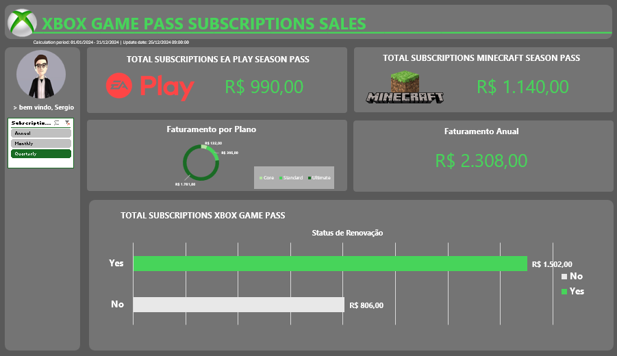

# 🎮 Dashboard de Vendas: Xbox Game Pass

  

## 🎯 Entendendo o Desafio
O objetivo deste projeto foi criar um dashboard de vendas interativo utilizando o Excel, com foco primordial na organização e visualização de dados. O painel foi desenvolvido para transformar dados brutos de assinaturas em informações visuais claras, elegantes e úteis, permitindo uma análise eficaz do desempenho de vendas e facilitando a tomada de decisões estratégicas baseadas em dados.

## 🛠️ O Que Foi Feito?
Criação de um Dashboard de Vendas completo no Excel com interface moderna (Dark Mode) baseada na identidade visual da marca Xbox. O projeto consolida múltiplas métricas em uma única tela interativa.

**Principais Funcionalidades e Visuais:**
* **Cards de KPIs:** Faturamento de Add-ons (EA Play e Minecraft) e Faturamento Anual total.
* **Gráfico de Rosca:** Distribuição do faturamento por tipo de plano (Core, Standard e Ultimate).
* **Gráfico de Barras Horizontais:** Análise de Retenção e Recorrência, comparando o faturamento de clientes com a Renovação Automática (Auto Renewal) ativada vs. desativada.
* **Menu Lateral Interativo:** Segmentação de dados (Slicer) permitindo o filtro instantâneo de todo o painel por Tipo de Assinatura (Annual, Monthly e Quarterly).

## 📊 Os Dados Utilizados
A base de dados bruta (planilha `Bases`) simula os registros de assinaturas do Xbox Game Pass. As principais variáveis analisadas incluem:
* **Subscription Type:** Ciclo de pagamento escolhido pelo usuário (Anual, Mensal, Trimestral).
* **Plan:** Categoria da assinatura principal.
* **Auto Renewal:** Indicador de comportamento do cliente sobre a manutenção da cobrança recorrente (Yes/No).
* **Adicionais:** Aquisição de pacotes extras como EA Play e Minecraft Season Pass.

## 🚀 Instruções para Reprodução

Para visualizar e interagir com o projeto na sua máquina, siga os passos abaixo:

1. **Pré-requisitos:** É necessário ter o Microsoft Excel instalado.
2. **Download:** Faça o clone deste repositório ou baixe o arquivo `.xlsx` diretamente através do botão *Download*.
3. **Execução:** Abra o arquivo Excel baixado.
4. **Navegação:** 
   * A aba principal **`Dashboard`** contém a interface visual e interativa.
   * Utilize os botões do menu lateral esquerdo (`Annual`, `Monthly`, `Quarterly`) para filtrar dinamicamente os resultados de todos os gráficos.
   * As abas `Bases` e `Cálculos` contêm os dados brutos e as Tabelas Dinâmicas que alimentam o painel, caso deseje auditar a lógica desenvolvida.

---
*Projeto desenvolvido para o desafio do Randstad - Análise de Dados - DIO.*
